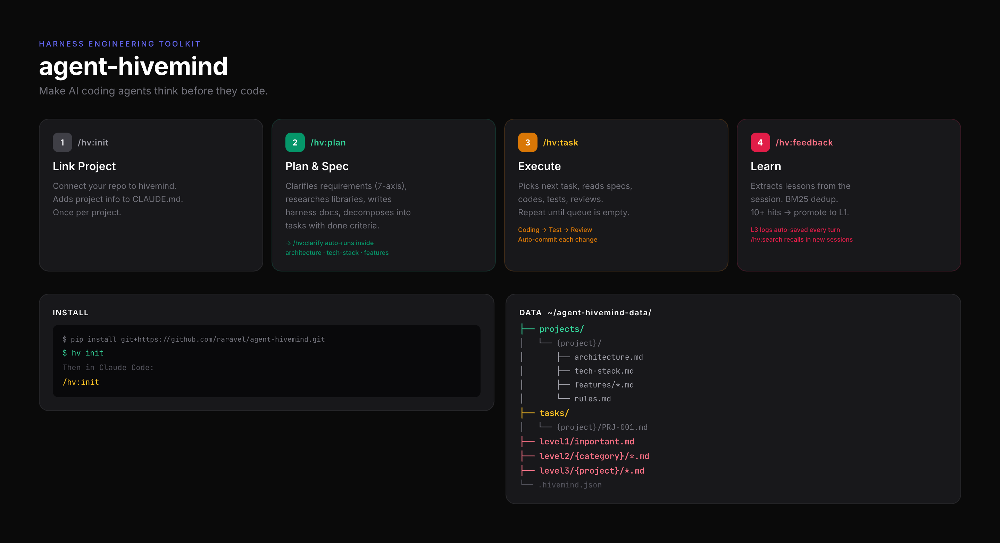

# agent-hivemind

A harness engineering toolkit for AI coding agents.

Makes AI agents think before they code — structured specs, task pipelines, and self-improving feedback loops.

> **[한국어](README_ko.md)** 문서도 제공됩니다.



## What is this?

When you tell an AI coding agent to "build me a todo app", it starts writing code immediately. But the result is usually incomplete — no architecture design, no library research, no completion criteria.

**agent-hivemind** fixes this by making the agent **think before it codes**:

```
"Build me a todo app"
        ↓
  /hv:clarify    ← 7-axis ambiguity check (what, why, how?)
        ↓
  /hv:plan       ← Write harness docs (architecture, tech stack, API specs)
                   + Decompose into tasks (with completion criteria)
        ↓
  /hv:task       ← Execute each task (read specs → code → test → review)
        ↓
  /hv:feedback   ← Save lessons learned from the session
```

## Installation

```bash
pip install git+https://github.com/raravel/agent-hivemind.git
```

Then run in your terminal (once):

```bash
hv init
```

This sets up:
- `~/agent-hivemind-data/` — data directory for specs, tasks, and feedback
- Claude Code plugin by default — installs all `/hv:*` skills automatically
- Model profiles — quality / balanced / budget presets

That's it. `hv init` is the only CLI command you need to run manually.

### Runtime targets

`hv init` now supports runtime selection:

```bash
hv init --target claude
hv init --target codex
hv init --target both
```

- `claude` is the default and preserves the existing `/hv:*` flow.
- `codex` installs the Codex plugin and personal marketplace entry.
- `both` prepares both runtimes against the same data directory.

## Usage

After `hv init`, most usage happens inside the target runtime rather than through the CLI.

### Claude Code

Claude keeps the existing `/hv:*` workflow.

### Step 1. Initialize a project — `/hv:init`

Open your project in Claude Code and run:

```
/hv:init
```

This links the current project to hivemind: creates the project data directories, writes a managed `AGENTS.md`, and for Claude also writes a managed `CLAUDE.md` shim. Your instruction files will contain:

```markdown
# Hivemind Project
- project: my-app
- data_path: ~/agent-hivemind-data
```

`AGENTS.md` is now the canonical shared instruction source. `CLAUDE.md` imports `@AGENTS.md` and keeps Claude-native `@.../architecture.md` and `@.../rules.md` imports.

### Step 2. Plan the project — `/hv:plan`

```
/hv:plan Build a todo list app with React Router 7 and SQLite
```

The agent will:
1. **Research** — look up library docs, API specs, best practices via web search
2. **Write harness documents** — architecture (with Mermaid diagrams), tech stack (with versions and usage patterns), feature specs (with API endpoints, data models, edge cases), build commands, and project rules
3. **Decompose into tasks** — each task has a description, references to the spec documents, and a concrete completion criteria checklist

All specs are saved to `~/agent-hivemind-data/projects/{name}/`. All tasks are saved to `~/agent-hivemind-data/tasks/{name}/`.

### Step 3. Execute tasks — `/hv:task`

```
/hv:task
```

The agent will:
1. Pick the next available task (respecting dependencies and priorities)
2. **Read the harness documents** referenced by the task
3. Implement the code based on the specs
4. Run tests and lint
5. Code review
6. Mark the task as done and generate an execution report

Repeat `/hv:task` to execute the next task, or let the agent continue through the queue.

### Step 4. Save feedback — `/hv:feedback`

At the end of a session (or anytime something noteworthy happens):

```
/hv:feedback
```

The agent reviews the session conversation, extracts lessons learned, and saves them as L2 documents. These are deduplicated using BM25 similarity — if a similar lesson already exists, it increments the hit counter instead of creating a duplicate.

### Step 5. Search past knowledge — `/hv:search`

In a new session, before starting work:

```
/hv:search authentication best practices
```

The agent:
1. Translates your query into English keyword variations (L2 docs are English-only)
2. Runs multiple BM25 searches
3. Auto-reads high-relevance documents (>= 70%) and presents the content
4. Asks you about medium-relevance documents (30-69%)
5. Skips low-relevance results (< 30%)

Only documents you actually read get their hit counter incremented. Documents with 10+ hits get an L1 promotion suggestion — these become "important lessons" that persist in `level1/important.md`.

### Bonus: Requirement verification — `/hv:clarify`

When you make an implementation request ("build X", "add Y", "refactor Z"), `/hv:clarify` automatically evaluates the ambiguity of your request across 7 axes:

| Axis | Core Question |
|------|---------------|
| Purpose (Why) | Why build this? What problem does it solve? |
| Scope | Where does it start and end? |
| Technical Context (How) | What tech stack, environment? |
| Integration (Fit) | How does it fit with existing systems? |
| User/IO (Who/What) | Who uses it? What are inputs/outputs? |
| Done Criteria | What must be true when it's done? |
| Constraints | What must be followed or avoided? |

It asks Socratic questions until all axes score <= 0.2, then outputs a confirmed spec. This runs automatically before `/hv:plan` — you can also invoke it directly with `/hv:clarify` for any request.

## How it works

### Harness Documents

Harness documents are project specs that agents reference during implementation:

```
projects/my-app/
├── architecture.md      ← System structure, module boundaries (Mermaid diagrams)
├── tech-stack.md        ← Tech stack, library versions, usage patterns
├── build-verify.md      ← Build/test commands, CI pipeline
├── rules.md             ← NEVER/ALWAYS rules, constraints
└── features/
    ├── 00_auth.md       ← Auth feature detailed spec
    ├── 01_todo-crud.md  ← Todo CRUD API spec
    └── 02_dashboard.md  ← Dashboard UI spec
```

`/hv:plan` writes these **before** creating any tasks. When `/hv:task` executes a task, it reads these docs first — so the agent always has full context.

### Feedback tiers

```
L3 (session logs)  →  L2 (structured lessons)  →  L1 (critical lessons)
   auto-saved            BM25 dedup                  promoted insights
   every turn            categorized                 important.md
```

- **L3**: Every user/assistant message is logged automatically via hooks (no action needed)
- **L2**: `/hv:feedback` extracts and saves lessons with similarity deduplication
- **L1**: Lessons read 10+ times get promoted to `level1/important.md`

### Data structure

```
~/agent-hivemind-data/
├── projects/                    ← Harness docs per project (specs)
│   └── {project}/
│       ├── architecture.md
│       ├── tech-stack.md
│       ├── build-verify.md
│       ├── rules.md
│       └── features/*.md
├── tasks/                       ← Issue tracker
│   └── {project}/
│       ├── PRJ-001.md           ← Task (frontmatter + completion criteria)
│       ├── PRJ-002.md
│       └── _reports/            ← Execution reports
├── level1/important.md          ← L1: Critical lessons (auto-generated)
├── level2/                      ← L2: Structured lessons
│   ├── frontend/
│   ├── backend/
│   ├── infra/
│   └── general/
├── level3/                      ← L3: Session logs (auto-saved)
├── index.json                   ← BM25 search index
└── .hivemind.json               ← Global config
```

## All skills

| Skill | Description | Trigger |
|-------|-------------|---------|
| `/hv:init` | Link project + set up workspace | Manual |
| `/hv:clarify` | 7-axis ambiguity check | Auto on implementation requests |
| `/hv:plan` | Write specs + decompose into tasks | Manual |
| `/hv:task` | Execute task pipeline (code → test → review) | Manual |
| `/hv:feedback` | Extract session lessons → L2 | Manual |
| `/hv:search` | Search past lessons with auto-read | Manual |
| `/hv:important` | Promote/demote L1 lessons | Manual |
| `/hv:audit` | Spec-code drift detection | Manual |

### Codex

Codex uses the same data repo and project link, but its invocation surface is different:

- `hv init --target codex` installs the `hv` Codex plugin and marketplace entry
- `hv link --target codex` writes `AGENTS.md` and repo-local `.codex/hooks.json`
- Codex reads `AGENTS.md` directly; it does not support Claude-style `@import`
- Codex installs a separate `hv-*` skill set such as `hv-init`, `hv-plan`, `hv-task`, and `hv-verify`
- Use those skills through Codex plugin/skills UX or natural-language requests that mention the `hv` plugin

In practice:

```text
Use the hv-plan skill to break this feature into tracked tasks.
Use the hv-task skill to execute the next ready task.
Use the hv plugin to plan this feature and create tracked tasks.
Use the hv plugin to run verification for the current project.
```

## Model profiles

The task execution pipeline uses different models for different roles:

| Profile | Planner | Executor | Reviewer |
|---------|---------|----------|----------|
| `quality` | opus | opus | opus |
| `balanced` | opus | sonnet | sonnet |
| `budget` | sonnet | sonnet | haiku |

Default is `balanced`. Change with `hv config --profile quality`.

## Inspiration

- [OpenAI: Harness Engineering](https://openai.com/index/harness-engineering/)
- [Anthropic: Effective Harnesses](https://www.anthropic.com/engineering/effective-harnesses-for-long-running-agents)
- [Addy Osmani: Self-Improving Agents](https://addyosmani.com/blog/self-improving-agents/)

## License

MIT
