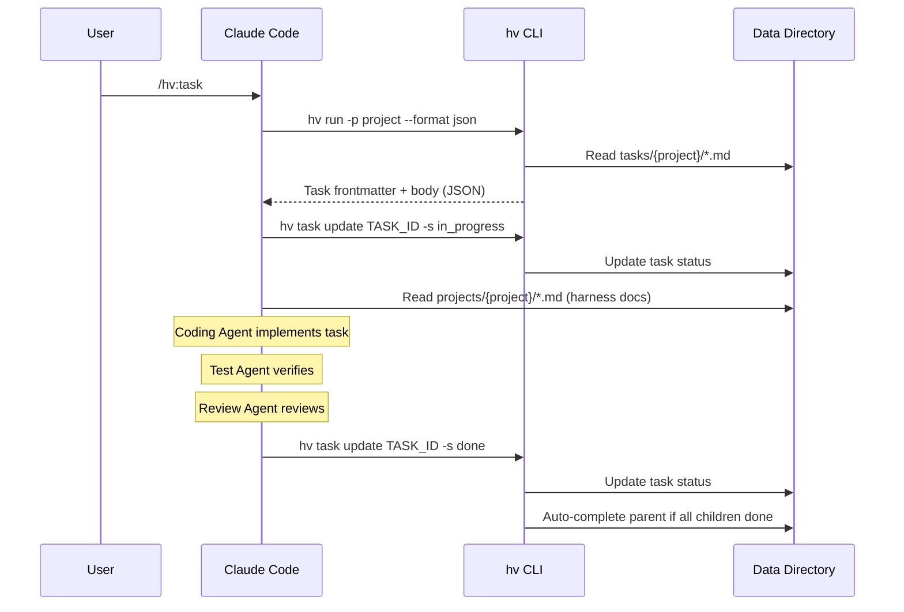
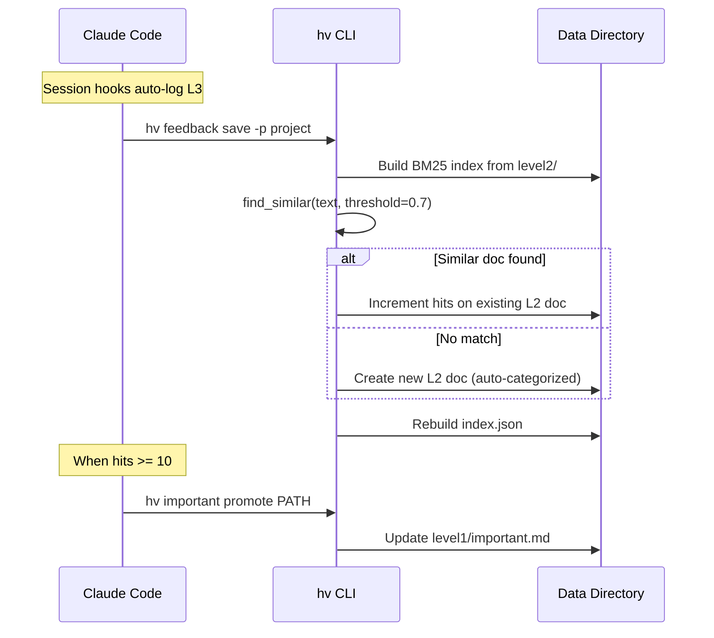

# Architecture

## Overview

Agent Hivemind is a harness engineering toolkit that makes AI coding agents think before they code. It consists of three layers: a Python CLI (`hv`), a Claude Code plugin (skills + hooks), and a file-based data directory.

## System Diagram

```mermaid
graph TB
    subgraph "User Layer"
        CC[Claude Code]
        Terminal[Terminal / CLI]
    end

    subgraph "Plugin Layer (Claude Code)"
        S_INIT["/hv:init"]
        S_CLARIFY["/hv:clarify"]
        S_PLAN["/hv:plan"]
        S_TASK["/hv:task"]
        S_FEEDBACK["/hv:feedback"]
        S_SEARCH["/hv:search"]
        S_IMPORTANT["/hv:important"]
        S_AUDIT["/hv:audit"]
        H_SESSION["hv-session-log.js"]
        H_PRECOMMIT["hv-pre-commit.js"]
    end

    subgraph "CLI Layer (Python / Click)"
        CMD_INIT["hv init"]
        CMD_LINK["hv link"]
        CMD_TASK["hv task *"]
        CMD_RUN["hv run"]
        CMD_FEEDBACK["hv feedback save"]
        CMD_SEARCH["hv search / search-read"]
        CMD_IMPORTANT["hv important *"]
        CMD_AUDIT["hv audit"]
        CMD_CONFIG["hv config"]
        CMD_INDEX["hv index rebuild"]
    end

    subgraph "Core Modules"
        CONFIG["config.py — HivemindConfig"]
        PARSER["parser.py — YAML frontmatter"]
        INDEXER["indexer.py — BM25 search"]
        SIMILARITY["similarity.py — dedup"]
        GIT["git.py — auto-commit"]
    end

    subgraph "Data Directory (~/agent-hivemind-data)"
        HIVEMIND_JSON[".hivemind.json"]
        PROJECTS["projects/{name}/"]
        TASKS["tasks/{name}/"]
        L1["level1/important.md"]
        L2["level2/{category}/"]
        L3["level3/{name}/"]
        INDEX["index.json"]
    end

    CC --> S_INIT & S_CLARIFY & S_PLAN & S_TASK & S_FEEDBACK & S_SEARCH & S_IMPORTANT & S_AUDIT
    CC --> H_SESSION & H_PRECOMMIT
    Terminal --> CMD_INIT & CMD_LINK & CMD_TASK & CMD_RUN & CMD_FEEDBACK & CMD_SEARCH & CMD_IMPORTANT & CMD_AUDIT & CMD_CONFIG & CMD_INDEX

    S_INIT --> CMD_INIT & CMD_LINK
    S_PLAN --> CMD_TASK
    S_TASK --> CMD_RUN & CMD_TASK
    S_FEEDBACK --> CMD_FEEDBACK
    S_SEARCH --> CMD_SEARCH
    S_IMPORTANT --> CMD_IMPORTANT
    S_AUDIT --> CMD_AUDIT

    CMD_INIT --> CONFIG
    CMD_LINK --> CONFIG
    CMD_TASK --> CONFIG & PARSER & GIT
    CMD_RUN --> PARSER
    CMD_FEEDBACK --> SIMILARITY & INDEXER & GIT
    CMD_SEARCH --> INDEXER
    CMD_IMPORTANT --> PARSER
    CMD_AUDIT --> CONFIG & PARSER
    CMD_INDEX --> INDEXER

    CONFIG --> HIVEMIND_JSON
    PARSER --> TASKS
    INDEXER --> INDEX & L2
    SIMILARITY --> L2
    GIT --> HIVEMIND_JSON

    H_SESSION --> L3
    S_PLAN --> PROJECTS
    S_FEEDBACK --> L2
    S_IMPORTANT --> L1
```

## Module Boundaries

### 1. CLI Entry Point (`src/hivemind/__main__.py`)

Click group that registers all subcommands. Single entry point: `hv` / `hivemind`.

### 2. Commands (`src/hivemind/commands/`)

Each file implements one CLI command group. Commands handle argument parsing, user-facing output, and orchestration of core modules.

| Module | Commands | Dependencies |
|--------|----------|-------------|
| `init.py` | `hv init` | config, installer/* |
| `link.py` | `hv link` | config |
| `task.py` | `hv task create/list/get/update/next` | config, parser, git |
| `run.py` | `hv run` | parser, task (imports) |
| `feedback.py` | `hv feedback save` | config, indexer, similarity, git |
| `search.py` | `hv search`, `hv search-read`, `hv index rebuild` | config, indexer |
| `important.py` | `hv important promote/demote/generate` | config, parser |
| `audit.py` | `hv audit` | config, parser |
| `config_cmd.py` | `hv config` | config |
| `commit.py` | `hv push` | git |
| `migrate.py` | V1->V2 migration | config |
| `stats.py` | `hv stats` | config, parser |

### 3. Core Modules (`src/hivemind/core/`)

Pure logic, no CLI dependencies (except Click exceptions in some cases).

- **config.py** — `HivemindConfig` class: load/save `.hivemind.json`, dot-notation get/set, project CRUD
- **parser.py** — YAML frontmatter parsing for task files, validation (status, required fields), create/update
- **indexer.py** — BM25Okapi tokenization, index build/save/load, search with fallback to token overlap for small corpora
- **similarity.py** — Thin wrapper around indexer for finding similar L2 docs above a threshold
- **git.py** — Auto-commit to data directory when `auto_commit` is enabled in config

### 4. Installer (`src/hivemind/installer/`)

Runs during `hv init`. Copies plugin files and registers with Claude Code.

- **skills.py** — Copies plugin to `~/.claude/plugins/hv/`, registers via `claude plugin marketplace add` + `claude plugin install`
- **hooks.py** — Copies JS hooks to `~/.claude/hooks/`, merges entries into `~/.claude/settings.json`
- **profiles.py** — Sets up model profiles (quality/balanced/budget) in config

### 5. Plugin (`src/hivemind/plugin/`)

Files that run inside Claude Code, not the Python runtime.

- **skills/*/SKILL.md** — Markdown skill definitions with frontmatter + execution steps
- **hooks/hv-session-log.js** — Logs every user/assistant message to L3 session files
- **hooks/hv-pre-commit.js** — Reminds agent to update specs before git commit

## Data Flow

### Task Execution Pipeline

### Feedback Loop

## Key Design Decisions

1. **File-based storage** — No database; all state is Markdown with YAML frontmatter. Human-readable, git-friendly, easy to debug.
2. **BM25 over embeddings** — Simpler, no external API needed, works offline. Token overlap fallback for < 3 docs.
3. **Hierarchical tasks** — Epic -> Story/Feature -> Task/Bug/Chore. Auto-completion propagates upward.
4. **Skills as Markdown** — Plugin skills are plain Markdown files with execution instructions, not code. Claude Code interprets them.
5. **Hooks as JavaScript** — Claude Code hooks run JS natively; Python hooks would need a bridge.
