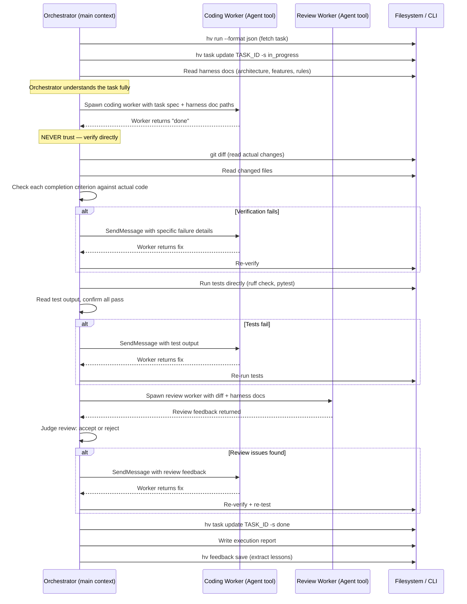

# Feature: Orchestrator Pipeline

## Overview

Rewrite the `/hv:task` execution pipeline so that the main Claude Code session acts as an **orchestrator** that delegates work to sub-agents via the `Agent` tool, but **never trusts their completion claims**. The orchestrator pulls results into its own context and verifies directly before proceeding.

## Current State

The current `/hv:task` pipeline runs everything in a single context:
1. Fetch task → 2. Mark in_progress → 3. Read harness docs → 4. Code (same context) → 5. Test (same context) → 6. Review (same context) → 7. Mark done

The agent self-declares completion at each stage. There is no independent verification.

## Proposed Execution Model



## Orchestrator Responsibilities

The orchestrator (main Claude Code context) does the following **itself**, never delegating:

1. **Read harness docs** — understands the full task context before delegating
2. **Verify code changes** — `git diff`, read files, check completion criteria line by line
3. **Run tests** — execute `ruff check`, `pytest`, build commands via Bash
4. **Judge review feedback** — decide accept/reject based on review output
5. **Decide done** — only the orchestrator can mark a task as done
6. **Write execution report** — summarize what happened across all stages
7. **Extract feedback** — capture lessons from the orchestration session

## Worker Responsibilities

Workers (spawned via `Agent` tool) are **executors only**:

1. **Coding worker** — receives task spec + harness doc paths, implements the code
2. **Review worker** — receives diff + harness docs, produces review feedback

Workers do NOT:
- Mark tasks as done or change status
- Run the full test suite (orchestrator does this)
- Decide whether their own work is acceptable

## Worker Prompt Structure

### Coding Worker Prompt

The orchestrator constructs the worker prompt with:
- Task description and completion criteria (from task file)
- Harness document paths to read (from Spec References)
- Build/verify commands (from build-verify.md)
- Project rules (from rules.md)
- Model selection based on profile (executor role)

### Review Worker Prompt

- The git diff of all changes
- Relevant harness doc paths
- Specific review checklist (boundary mismatches, rule violations, completion criteria coverage)
- Model selection based on profile (reviewer role)

## Verification Protocol

After each worker returns, the orchestrator performs:

### Post-Coding Verification
1. `git diff --stat` — confirm files were actually changed
2. Read each changed file
3. For each completion criterion in the task:
   - Check if the criterion is addressed by the code changes
   - Mark as verified or failed
4. If any criterion fails → SendMessage to worker with specifics

### Post-Test Verification
1. Run lint: `ruff check src/ tests/`
2. Run type check: `mypy src/`
3. Run tests: `pytest`
4. Read output — confirm zero failures, not just exit code

### Post-Review Verification
1. Read review feedback
2. Categorize issues: blocking vs. advisory
3. If blocking issues exist → SendMessage to coding worker with fixes needed
4. If only advisory → proceed to done

## Retry Policy

- Coding: max 2 retries via SendMessage (continue same worker for context preservation)
- Tests: max 2 retries (send test output back to coding worker)
- Review: max 1 round of fixes
- If all retries exhausted → mark task `blocked`, save feedback about the failure

## Configuration

The orchestrator reads model profiles from `.hivemind.json`:

```json
{
  "profiles": {
    "balanced": {
      "planner": "opus",    // orchestrator model (inherited from session)
      "executor": "sonnet", // coding worker model
      "reviewer": "sonnet"  // review worker model
    }
  }
}
```

## Files to Modify

- `plugin/skills/task/SKILL.md` — rewrite pipeline stages to orchestrator pattern
- `plugin/skills/task/references/pipeline-stages.md` — update stage definitions
- `plugin/skills/task/references/agent-prompts.md` — split into orchestrator/worker prompts
- `plugin/skills/task/references/error-handling.md` — update retry logic for orchestrator
