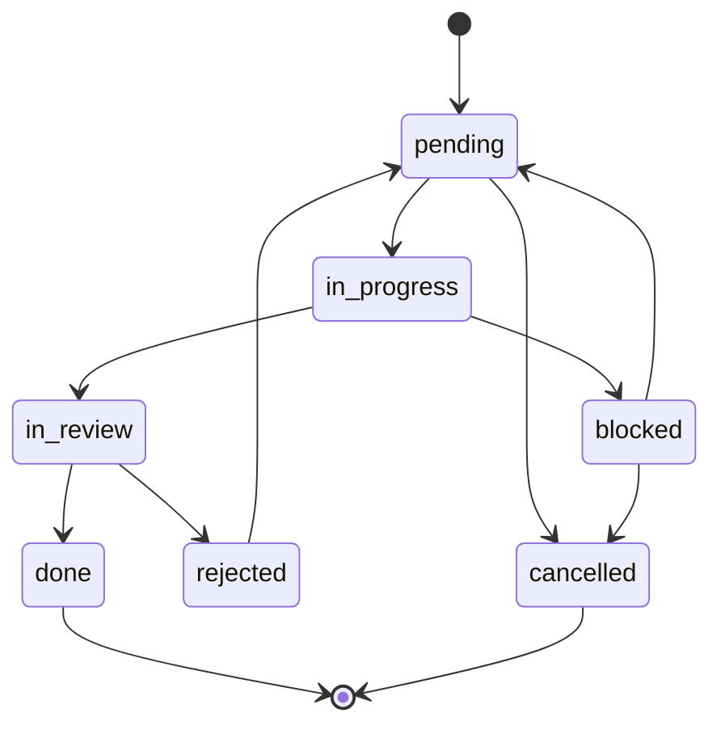

# Feature: Task System Fixes

## 1. VALID_STATUSES Bug Fix

### Problem

`parser.py` line 9-15 defines `VALID_STATUSES` as:
```python
VALID_STATUSES = ["pending", "in_progress", "in_review", "rejected", "done"]
```

But `task-format.md` and SKILL.md references document `blocked` and `cancelled` as valid statuses. The orchestrator pipeline needs `blocked` (for tasks that exhaust retries). Calling `hv task update TASK_ID -s blocked` currently raises a validation error.

### Fix

Add `blocked` and `cancelled` to `VALID_STATUSES` in `src/hivemind/core/parser.py`:

```python
VALID_STATUSES = [
    "pending",
    "in_progress",
    "in_review",
    "rejected",
    "blocked",
    "cancelled",
    "done",
]
```

Update tests in `tests/unit/` to cover the new statuses.

### State Diagram



## 2. Task Index for Performance

### Problem

`_scan_tasks()` in `commands/task.py` calls `d.glob("*.md")` and `frontmatter.load()` on every file, on every command invocation. At 500+ tasks this becomes slow.

### Solution

Add a lightweight index file `tasks/{project}/_index.json` that caches task metadata:

```json
{
  "version": 1,
  "tasks": {
    "AGE-001": {
      "status": "done",
      "priority": "high",
      "type": "task",
      "parent": "AGE-000",
      "depends_on": [],
      "title": "Implement BM25 search",
      "updated": "2025-01-15"
    }
  }
}
```

### Behavior

- **Write-through**: `hv task create` and `hv task update` update both the .md file and `_index.json`
- **Read from index**: `hv task list`, `hv task next`, `hv run` read from `_index.json` instead of globbing
- **Fallback**: if `_index.json` is missing or corrupt, fall back to full scan and rebuild
- **Rebuild command**: `hv index rebuild` (already exists for L2) extended to also rebuild task indices
- **No breaking changes**: existing task .md files remain the source of truth; index is a cache

### Files to Modify

- `src/hivemind/core/parser.py` — VALID_STATUSES fix
- `src/hivemind/commands/task.py` — index read/write integration
- `tests/unit/test_task.py` or equivalent — new status tests
