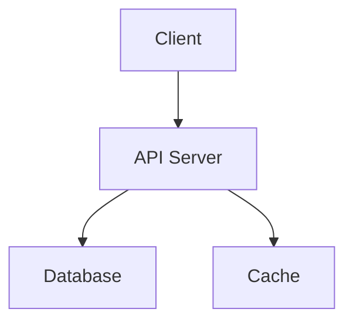

# hv-plan -- Task planning and decomposition

Plans a project by creating harness documents (specs) first, then decomposing work into concrete tasks with completion criteria.

## When to use

- User describes work that should be planned and decomposed into tasks
- User says "plan this", "make a plan", "break this down", "add tasks"
- User wants to create, list, view, update, or pick the next task
- User asks the `hv` plugin to plan work in Codex
- User asks to "re-ground" the harness or says the tech stack docs are wrong/stale → run **Re-grounding mode** (see below)

## Mode selection

Resolve `{project}` from `cat .hivemind-link.json` and `{data_path}` from `hv config data_path`. Check whether `{data_path}/projects/{project}/` already has harness docs.

- **No harness directory** → **Full planning mode**: Phase 0 (Grounding) → Phase 1 (Harness Documents) → Phase 2 (Task Creation).
- **Harness directory exists** → ask the user (one question) whether to:
  - **(a)** plan a new feature on top of the existing harness (Phase 0 still runs to refresh tech-stack — cheap; then jump to Phase 1 for the *new* feature only and Phase 2 for tasks), OR
  - **(b)** re-ground only — run Phase 0 and rewrite **only** `tech-stack.md`. Do not touch `architecture.md`, `features/*.md`, `rules.md`, or `verify.md`. No tasks created. Report "re-grounded".

Default for (a)/(b) is (a) when the user said "plan", default is (b) when the user said "reground" / "fix tech-stack" / similar.

## Planning a new project or feature (Batch task creation)

When decomposing a larger request into tasks, you MUST follow this order:

### Phase 0: Grounding (MANDATORY — must complete before Phase 1)

Before writing any harness prose, ground the planner in the **actual repository state**. The point: tech-stack content must be derivable from manifests and build artifacts, not from agent memory. Past planner runs have hallucinated wrong major versions (e.g. listing Tailwind v3 in a project running v4) and listed legacy/vendored libraries as if they were active stack — this step prevents that.

Run all four sub-steps. Use Bash + Read; no special tooling required.

**0.1 — Detect ecosystems.** Check for the presence of these manifest files at the project root (and one level down for monorepos):

```
package.json | pnpm-workspace.yaml | yarn.lock      # Node
pyproject.toml | requirements*.txt | setup.cfg      # Python
Cargo.toml | Cargo.lock                             # Rust
go.mod                                              # Go
Gemfile | Gemfile.lock                              # Ruby
composer.json                                       # PHP
pom.xml | build.gradle*                             # JVM
*.csproj | packages.config                          # .NET
```

Record every manifest found.

**0.2 — Extract active dependencies with pinned versions.** For each manifest, read it and list every direct dependency with its version constraint. Examples of acceptable forms: `^5.1.0`, `~1.2.3`, `1.2.3`, `>=2,<3`. Reject `latest` or `*` — note them as unpinned.

**0.3 — Scan build artifacts for version headers.** Many bundlers/compilers stamp version comments in their output. Check the first 5 lines of every `*.css` and `*.js` under directories named `dist/`, `build/`, `public/`, `static/`, or any `tailwind*.css`/`tailwind*.out.css`. Typical pattern: `/*! libname vX.Y.Z | LICENSE | url */`. Treat artifact versions as **ground truth** — if the manifest says one major version but the artifact header says another, the artifact wins.

**0.4 — Classify vendored / legacy assets.** Find script/style tags or files referencing libraries that are NOT in any manifest:

```bash
grep -rE '<script[^>]+src=' <views_or_templates_dir> 2>/dev/null
grep -rE '<link[^>]+rel="stylesheet"' <views_or_templates_dir> 2>/dev/null
```

Any library detected here but absent from manifests → classify `legacy/vendored`. If `rules.md` already exists and discourages this library (phrases like "prefer X over Y", "avoid jQuery", "vanilla JS only"), explicitly mark it `legacy` in the upcoming tech-stack.md.

**0.5 — Cross-check before writing.** Before proceeding to Phase 1, output a short grounding summary to the user:

```
Detected manifests: package.json
Active deps (15): express ^5.1.0, ejs ^3.1.10, ...
Build artifact versions: tailwindcss v4.1.18 (views/inc/css/tailwind.css)
Legacy / vendored: jquery 3.7.1 (views/inc/js/jquery-3.7.1.min.js)
Unresolved: <anything you couldn't categorize>
```

This summary must appear in the user-visible message before Phase 1 starts. If anything is ambiguous, ask before proceeding — do not guess.

### Phase 1: Harness Documents (MANDATORY before creating tasks)

Before creating ANY tasks, write harness documents to `{data_path}/projects/{project}/`.
Phase 0's grounding output feeds directly into `tech-stack.md` below.

Research what you need (library docs, API specs, etc.) via web search BEFORE writing these documents. The documents must contain enough detail for an agent to implement each task without asking questions.

Create these files by writing directly to the filesystem:

1. **`architecture.md`** — System architecture, module boundaries, data flow
   - Component diagram using **Mermaid** (`graph TD`, `flowchart`, `C4Context`, etc.)
   - Dependency direction rules
   - Key design decisions and rationale

2. **`tech-stack.md`** — Technology choices grounded in Phase 0 output. **Required sections, in this order:**

   ````markdown
   # <Project> Tech Stack

   ## Active Dependencies
   <Every manifest-listed dependency with pinned version. Use `- name version — one-line role/rationale` format so the rubric counts it as a versioned library.>
   - express ^5.1.0 — HTTP server (middleware composability)
   - ejs ^3.1.10 — server-rendered templates (existing convention)

   ## Build Artifacts
   <Versions detected from compiled output headers in Phase 0.3. Ground truth for the running app — if this disagrees with Active Dependencies, the artifact wins.>
   - tailwindcss v4.1.18 (from `views/inc/css/tailwind.css` header)

   ## Legacy / Vendored
   <Libraries in the repo but NOT in any manifest. Treat as read-only unless `rules.md` explicitly permits new use.>
   - jquery 3.7.1 — vendored at `views/inc/js/jquery-3.7.1.min.js`; new code uses vanilla JS per rules.md

   ## Project Structure
   <Directory layout, key paths.>

   ## Rationale
   <At least one "why this, not X" — required for tech_stack rubric anchor 10.>
   ````

   Rules for this file:
   - Every entry in `## Active Dependencies` MUST appear in at least one detected manifest. If it doesn't, move it to `## Legacy / Vendored` with a note.
   - Pinned version is required (`^1.2.3`, `>=1,<2`, `1.2.3`). `latest` and `*` are not versions.
   - Do NOT carry over library names from a previous tech-stack.md without verifying they still exist. Re-derive from Phase 0 each time.

3. **`verify.md`** — Verification commands (language-agnostic)
   - **What the orchestrator runs to confirm a task is complete.**
   - Any executable command is fine: lint, type check, unit test, integration test, build, smoke test, schema validation, contract test, etc.
   - Group commands by stage (`lint`, `type`, `test`, `build`) when the project distinguishes them; otherwise one `check` stage is enough.
   - Each entry: the command string + what it proves (one sentence).
   - Examples:
     - Python project: `ruff check .` / `mypy src/` / `pytest -q`
     - Node project: `npm run lint` / `npm run typecheck` / `npm test`
     - Go project: `go vet ./...` / `go test ./...`
     - Any language: project-defined scripts like `make check`, `./scripts/verify.sh`
   - NEVER assume a language. The project's verify.md is the single source of truth for what "done" means operationally.
   - Legacy: `build-verify.md` is accepted as a fallback for v2 projects. New projects use `verify.md`.

4. **`rules.md`** — NEVER/ALWAYS rules, forbidden files, constraints
   - Security rules, coding conventions
   - Files that should not be modified

5. **`features/`** — One file per feature with detailed spec
   - `features/00_feature-name.md` — Inputs, outputs, UI flow, API endpoints, edge cases
   - Include **Mermaid** diagrams for data flow, sequence diagrams, state machines, ER diagrams where appropriate
   - Include enough detail that an agent can implement without ambiguity
   - Reference specific library APIs, data models, route paths
   - **Required `## Implementation` section** at the end of each feature file. Format:

     ````markdown
     ## Implementation
     - `views/target/js/assign.js` — primary UI + state management
     - `routes/target/assign.js` — backend length validation
     - external: `@plab/util` (mssql helper used by routes)
     ````

     This section is the code↔spec map that `hv audit` walks and `/hv:task` updates after each merge. On initial creation you may list only the paths you intend to use; tasks will refine this list as they run.

### Diagram Rules

Use **Mermaid** for all diagrams in harness documents:

- **Architecture / component relationships**: `graph TD` or `flowchart`
- **API / interaction flow**: `sequenceDiagram`
- **Data models / DB schema**: `erDiagram`
- **State machines / status transitions**: `stateDiagram-v2`
- **Task dependencies**: `graph LR` with `-->` edges

Example:
````markdown

````

### Phase 2: Task Creation (Hierarchical)

After harness documents are written, create tasks using a hierarchy: **Epic → Story → Task**.

**Create in this order:**

```bash
# 1. Create the epic (top-level grouping)
hv task create -p <project> -t "Add deadlines" --type epic --priority high

# 2. Create stories under the epic
hv task create -p <project> -t "Backend API" --type story --parent <EPIC-ID> --priority high
hv task create -p <project> -t "Frontend UI" --type story --parent <EPIC-ID> --depends <STORY1-ID>

# 3. Create tasks under each story
hv task create -p <project> -t "Create deadline API" --type task --parent <STORY-ID> --priority high
hv task create -p <project> -t "Update deadline API" --type task --parent <STORY-ID> --depends <PREV-TASK-ID>
```

**Hierarchy rules:**
- `epic`: top-level grouping, no parent
- `story`: groups related tasks, parent must be an epic
- `task`/`bug`/`chore`: actual work items, parent must be a story

**After creating each task via CLI, IMMEDIATELY write the body:**

```bash
# Find the task file path from the CLI output, then append content to it
```

**Required task body format:**

```markdown
## Description
What this task implements and why.

## Spec References
- `projects/{project}/architecture.md` — relevant section
- `projects/{project}/features/00_feature-name.md` — full feature spec

## Completion Criteria
- [ ] Criterion 1 (concrete, verifiable)
- [ ] Criterion 2 (concrete, verifiable)
- [ ] Build/lint passes
- [ ] Tests pass (if applicable)
```

**Completion criteria rules:**
- Each criterion must be objectively verifiable (not "works well" but "returns 200 on POST /api/todos")
- Include at least one build/lint criterion
- Include functional criteria (what the code must do)
- Include integration criteria if the task touches multiple modules

3. **Wire dependencies** — Use `--depends` for tasks that require previous tasks to be done first
4. **Present the full plan** — List all tasks with their IDs, dependencies, and priorities at the end

## Managing existing tasks

### Listing tasks

```bash
hv task list
hv task list -p <project>
hv task list -p <project> -s pending
hv task list --priority high
```

### Getting task details

```bash
hv task get <TASK-ID>
hv task get <TASK-ID> --format json
```

### Updating a task

```bash
hv task update <TASK-ID> --status <pending|in_progress|done|blocked|cancelled>
hv task update <TASK-ID> --priority high
hv task update <TASK-ID> --title "New title"
```

### Getting the next task

```bash
hv task next
hv task next -p <project>
```

## Task file format

See [references/task-format.md](references/task-format.md) for the frontmatter schema.

## Important Rules

- **NEVER skip Phase 0.** Tech-stack content must be grounded in manifests + build artifacts, not agent memory. Past runs have hallucinated wrong major versions and the lesson is mandatory grounding.
- **NEVER create tasks before writing harness documents.** Phase 1 MUST complete before Phase 2.
- **NEVER create a task without a body.** Every task must have description, spec references, and completion criteria.
- **NEVER carry library names from a previous tech-stack.md without re-verifying** against the current manifests + artifacts (Phase 0).
- **ALWAYS research before writing specs.** Use web search to get accurate library APIs, configuration formats, and best practices.
- **ALWAYS use the `hv task` CLI** via Bash tool for creating/updating tasks. Write the body directly to the file after CLI creation.
- **ALWAYS include a `## Implementation` section in every feature file.** Even an initial intent-only list is fine — tasks will refine it.
- NEVER create a task without a `--project` flag.
- ALWAYS validate that the project exists (was linked via `hv link`) before creating tasks.
- NEVER write task/spec content in Korean. All content must be in English for BM25 consistency.
- When decomposing work, prefer smaller focused tasks over large monolithic ones.
