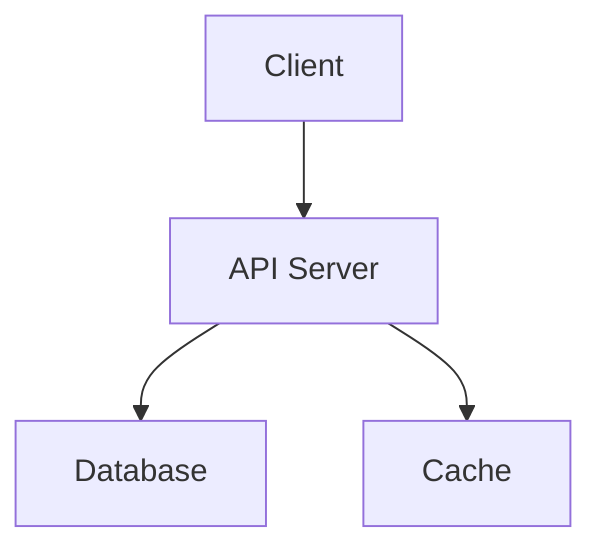

# /hv:plan -- Task planning and decomposition

Plans a project by creating harness documents (specs) first, then decomposing work into concrete tasks with completion criteria.

## When to use

- User describes work that should be planned and decomposed into tasks
- User says "plan this", "make a plan", "break this down", "add tasks"
- User wants to create, list, view, update, or pick the next task
- User runs `/hv:plan` explicitly

## Planning a new project or feature (Batch task creation)

When decomposing a larger request into tasks, you MUST follow this order:

### Phase 1: Harness Documents (MANDATORY before creating tasks)

Before creating ANY tasks, write harness documents to `{data_path}/projects/{project}/`.
Find the data_path from `.hivemind-link.json` in the project root or from `.hivemind.json`.

Research what you need (library docs, API specs, etc.) via web search BEFORE writing these documents. The documents must contain enough detail for an agent to implement each task without asking questions.

Create these files by writing directly to the filesystem:

1. **`architecture.md`** — System architecture, module boundaries, data flow
   - Component diagram using **Mermaid** (`graph TD`, `flowchart`, `C4Context`, etc.)
   - Dependency direction rules
   - Key design decisions and rationale

2. **`tech-stack.md`** — Technology choices with specific versions and usage patterns
   - Libraries with version numbers and import examples
   - Project structure (directory layout)
   - Configuration files needed

3. **`build-verify.md`** — Build commands, test commands, CI pipeline
   - How to install dependencies
   - How to run dev server, tests, linter
   - Completion criteria for the entire project

4. **`rules.md`** — NEVER/ALWAYS rules, forbidden files, constraints
   - Security rules, coding conventions
   - Files that should not be modified

5. **`features/`** — One file per feature with detailed spec
   - `features/00_feature-name.md` — Inputs, outputs, UI flow, API endpoints, edge cases
   - Include **Mermaid** diagrams for data flow, sequence diagrams, state machines, ER diagrams where appropriate
   - Include enough detail that an agent can implement without ambiguity
   - Reference specific library APIs, data models, route paths

### Diagram Rules

Use **Mermaid** for all diagrams in harness documents:

- **Architecture / component relationships**: `graph TD` or `flowchart`
- **API / interaction flow**: `sequenceDiagram`
- **Data models / DB schema**: `erDiagram`
- **State machines / status transitions**: `stateDiagram-v2`
- **Task dependencies**: `graph LR` with `-->` edges

Example:
````markdown

````

### Phase 2: Task Creation

After harness documents are written, create tasks. Each task MUST have:

1. **A clear title** (English, imperative verb: "Implement X", "Add Y", "Set up Z")
2. **A body with completion criteria** — Write this DIRECTLY into the task .md file after creating it via CLI
3. **References to harness documents** — Which spec docs the task implementer should read

**Task creation flow:**

```bash
# 1. Create the task via CLI
hv task create -p <project> -t "<title>" --priority <high|medium|low> --type <task|feature|bug|chore> [--depends <ID>]
```

```bash
# 2. IMMEDIATELY write the task body with completion criteria
# Find the task file path from the CLI output, then append content to it
```

**Required task body format:**

```markdown
## Description
What this task implements and why.

## Spec References
- `projects/{project}/architecture.md` — relevant section
- `projects/{project}/features/00_feature-name.md` — full feature spec

## Completion Criteria
- [ ] Criterion 1 (concrete, verifiable)
- [ ] Criterion 2 (concrete, verifiable)
- [ ] Build/lint passes
- [ ] Tests pass (if applicable)
```

**Completion criteria rules:**
- Each criterion must be objectively verifiable (not "works well" but "returns 200 on POST /api/todos")
- Include at least one build/lint criterion
- Include functional criteria (what the code must do)
- Include integration criteria if the task touches multiple modules

3. **Wire dependencies** — Use `--depends` for tasks that require previous tasks to be done first
4. **Present the full plan** — List all tasks with their IDs, dependencies, and priorities at the end

## Managing existing tasks

### Listing tasks

```bash
hv task list
hv task list -p <project>
hv task list -p <project> -s pending
hv task list --priority high
```

### Getting task details

```bash
hv task get <TASK-ID>
hv task get <TASK-ID> --format json
```

### Updating a task

```bash
hv task update <TASK-ID> --status <pending|in_progress|done|blocked|cancelled>
hv task update <TASK-ID> --priority high
hv task update <TASK-ID> --title "New title"
```

### Getting the next task

```bash
hv task next
hv task next -p <project>
```

## Task file format

See [references/task-format.md](references/task-format.md) for the frontmatter schema.

## Important Rules

- **NEVER create tasks before writing harness documents.** Phase 1 MUST complete before Phase 2.
- **NEVER create a task without a body.** Every task must have description, spec references, and completion criteria.
- **ALWAYS research before writing specs.** Use web search to get accurate library APIs, configuration formats, and best practices.
- **ALWAYS use the `hv task` CLI** via Bash tool for creating/updating tasks. Write the body directly to the file after CLI creation.
- NEVER create a task without a `--project` flag.
- ALWAYS validate that the project exists (was linked via `hv link`) before creating tasks.
- NEVER write task/spec content in Korean. All content must be in English for BM25 consistency.
- When decomposing work, prefer smaller focused tasks over large monolithic ones.
