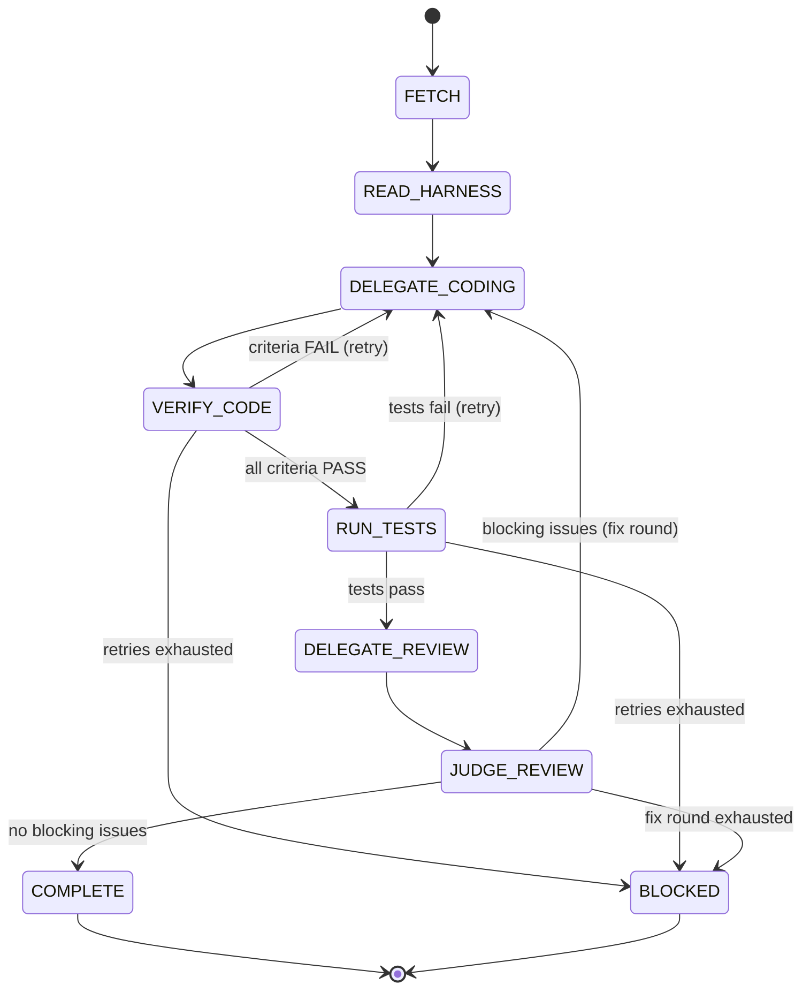

# Pipeline Stages -- Orchestrator Model

The `/hv:task` pipeline uses an **orchestrator model**: the main context (orchestrator) delegates work to sub-agents but verifies results directly before proceeding.

## Overview

```
Orchestrator (main context)
  │
  ├── FETCH ──────────── hv run --format json
  ├── READ_HARNESS ───── Read harness docs (orchestrator does this)
  ├── DELEGATE_CODING ── Agent tool → coding worker
  ├── VERIFY_CODE ────── Orchestrator reads git diff, checks criteria
  ├── RUN_TESTS ──────── Orchestrator runs ruff/mypy/pytest via Bash
  ├── DELEGATE_REVIEW ── Agent tool → review worker
  ├── JUDGE_REVIEW ───── Orchestrator reads feedback, decides accept/reject
  └── COMPLETE ───────── hv task update --status done + report + feedback
```

## Stage 0: FETCH

**Actor:** Orchestrator
**Purpose:** Select and load the next task.

```bash
hv run --format json -p <project>
```

**Output:** JSON with `id`, `frontmatter`, `body`, `path`.
**Success:** Task returned (exit code 0).
**Failure:** No tasks (exit code 1) — pipeline stops.

Then: `hv task update <TASK-ID> --status in_progress`

## Stage 1: READ_HARNESS

**Actor:** Orchestrator (NEVER delegate this)
**Purpose:** Understand the task context before delegating any work.

**Process:**
1. Read all documents listed in the task's **Spec References** section.
2. Read `build-verify.md` for build/test commands.
3. Read `rules.md` for constraints.
4. Search L2 knowledge: `hv search "<task title keywords>"`.

**Success:** Orchestrator has full understanding of what the task requires.

## Stage 2: DELEGATE_CODING

**Actor:** Coding Worker (via Agent tool, **executor** model)
**Purpose:** Implement the code changes.

**Worker receives:**
- Task description and completion criteria
- Harness document paths to read
- Build/verify commands
- Project rules
- Relevant L2 lessons (if found)

**Worker does:**
1. Read the harness documents.
2. Implement code changes.
3. Run lint and type checks.
4. Return results.

**Worker does NOT:**
- Mark the task as done or change status
- Run the full test suite
- Decide whether work is complete

## Stage 3: VERIFY_CODE

**Actor:** Orchestrator (NEVER delegate this)
**Purpose:** Independently verify the coding worker's output.

**Process:**
1. Run `git diff` and read the actual changes.
2. Read each changed file.
3. Parse the task's `## Completion Criteria` checklist.
4. For each criterion, check if the code changes address it:
   ```
   [PASS] API endpoint returns 200 on POST /api/todos
   [FAIL] Rate limiting at 100 req/min — no rate limit code found
   ```
5. If any criterion is `[FAIL]`:
   - Use **SendMessage** to continue the same worker with specific failure details.
   - Max 2 retries.
   - If all retries exhausted → mark `blocked`.

**Success:** All criteria verified as `[PASS]`.

## Stage 4: RUN_TESTS

**Actor:** Orchestrator (NEVER delegate this)
**Purpose:** Run the project's test suite and verify results directly.

**Process:**
```bash
ruff check src/ tests/        # lint
mypy src/                      # type check
pytest                         # test suite
```

1. Read the full test output (not just exit codes).
2. Distinguish between new failures and pre-existing failures.
3. If new failures exist:
   - Use **SendMessage** to send test output to the coding worker.
   - Worker fixes, orchestrator re-runs tests.
   - Max 2 retries.
   - If all retries exhausted → mark `blocked`.

**Success:** All tests pass, or only pre-existing failures remain.

## Stage 5: DELEGATE_REVIEW

**Actor:** Review Worker (via Agent tool, **reviewer** model)
**Purpose:** Code review with focus on quality and boundary mismatches.

**Worker receives:**
- Full `git diff` output
- Harness document paths (architecture, rules)
- Boundary mismatch checklist:
  - API response shape matches calling code
  - Function signatures match all call sites
  - Type definitions match actual usage
  - Config keys match what code reads
  - Import paths resolve correctly
- Instruction: categorize issues as **blocking** vs. **advisory**

**Worker returns:** Structured review with categorized issues.

## Stage 6: JUDGE_REVIEW

**Actor:** Orchestrator (NEVER delegate this)
**Purpose:** Read review feedback and make the accept/reject decision.

**Process:**
1. Read the review output.
2. Categorize issues:
   - **Blocking:** Must fix before completion.
   - **Advisory:** Nice-to-have, can proceed without fixing.
3. If blocking issues exist:
   - Use **SendMessage** to send feedback to the coding worker.
   - Worker fixes → orchestrator re-verifies (VERIFY_CODE) and re-tests (RUN_TESTS).
   - Max 1 review round.
   - If still blocking after 1 round → mark `blocked`.
4. If only advisory or no issues → proceed.

**Success:** No blocking issues remain.

## Stage 7: COMPLETE

**Actor:** Orchestrator
**Purpose:** Finalize the task.

**Prerequisites (ALL must be true):**
- All completion criteria verified as `[PASS]`
- All tests pass
- Review has no blocking issues

**Process:**
1. `hv task update <TASK-ID> --status done`
2. Write execution report to `_reports/{TASK-ID}-report.md`
3. If non-trivial events occurred (retries > 0 or blocking review issues):
   append `## Incident` section with forensic details (what broke / why / what fixed it)
4. Do NOT invoke `/hv:feedback`. Do NOT ask user for confirmation.
5. Proceed immediately to the next task.

**Report format:**
```yaml
---
task_id: PRJ-001
duration_minutes: 12
coding_retries: 0
test_retries: 1
review_rounds: 0
review_passed: true
lint_failed: false
---

## Summary
Brief description of what was implemented.

## Changes
- file1.py: Added authentication middleware

## Verification
- ruff check: passed
- mypy: passed
- pytest: 50 passed, 0 failed

## Notes
Any observations or caveats.

## Incident
_(Only present if retries > 0 or review had blocking issues)_

### What broke
- Test `test_auth_middleware` failed: expected 401, got 500

### Why
- Error handler was not registered before auth middleware in the pipeline

### What fixed it
- Moved error handler registration above auth middleware (retry 1 of 2)
```

**On blocked tasks:**
```bash
hv task update <TASK-ID> --status blocked --reason "<what failed and why>"
```
Record incident in report, then proceed to the next task (do NOT stop the pipeline).

## Pipeline State Machine



## Retry Summary

| Stage | Max Retries | Method | On Exhaustion |
|-------|-------------|--------|---------------|
| VERIFY_CODE | 2 | SendMessage to coding worker | `blocked` |
| RUN_TESTS | 2 | SendMessage to coding worker | `blocked` |
| JUDGE_REVIEW | 1 | SendMessage to coding worker | `blocked` |
